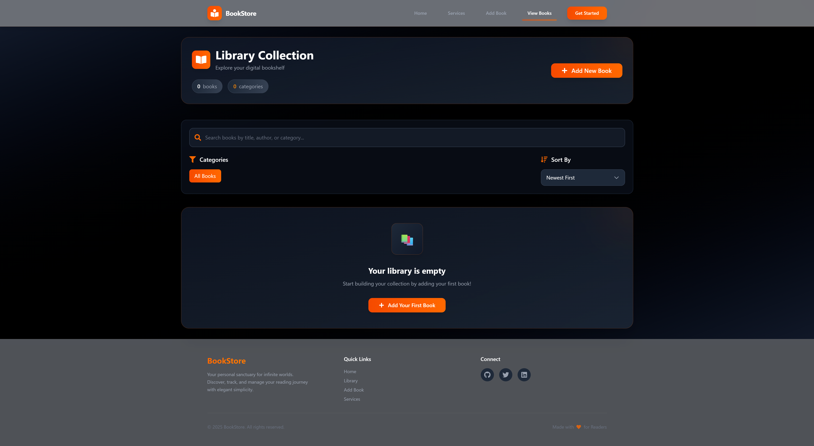
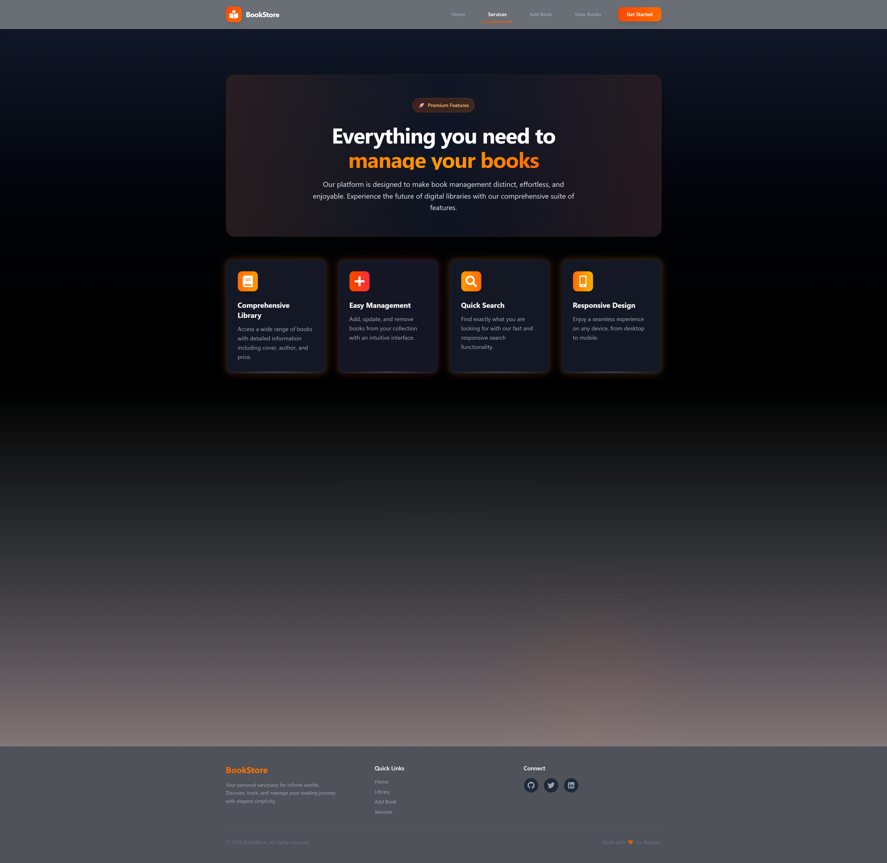

# 📚 Book Management System - Frontend

A modern, responsive, and aesthetically pleasing React application for managing a personal digital library. This frontend interacts with a Node.js/Express backend to perform full CRUD operations on a book collection.

## ✨ Features

- **🎨 Premium UI/UX:** Built with a dark "Black & Orange" theme, featuring glassmorphism, smooth animations (`framer-motion`), and responsive design.

## 📸 Application Preview

## 📸 Application Preview

### 🏠 Home Page


### 📚 View Books Library


### ➕ Add Book / Edit Book


### 🛠️ Services Page


- **📱 Responsive Layout:** Optimized for desktops, tablets, and mobile devices.
- **🔍 Advanced Search & Filter:** Real-time searching by title, author, or category. Filter by categories and sort by price, title, or date.
- **🖼️ Image Upload:** Drag-and-drop cover image upload with preview and "Update/Remove" functionality.
- **⚡ Reactive Updates:** Instant UI updates and toast notifications (`react-hot-toast`) for user actions.
- **📊 Dashboard:** Home page with parallax effects and library statistics.

## 🛠️ Tech Stack

- **Framework:** [React](https://react.dev/) (v19) with [TypeScript](https://www.typescriptlang.org/)
- **Build Tool:** [Vite](https://vitejs.dev/)
- **Styling:** [Tailwind CSS v4](https://tailwindcss.com/)
- **State Management:** [Redux Toolkit](https://redux-toolkit.js.org/)
- **Routing:** [React Router v7](https://reactrouter.com/)
- **Animations:** [Framer Motion](https://www.framer.com/motion/)
- **HTTP Client:** [Axios](https://axios-http.com/)
- **Icons:** [React Icons](https://react-icons.github.io/react-icons/)

## 🚀 Getting Started

### Prerequisites

- Node.js (v18 or higher)
- npm or yarn

### Installation

1. Navigate to the frontend directory:
   ```bash
   cd Frontend
   ```

2. Install dependencies:
   ```bash
   npm install
   ```

3. Start the development server:
   ```bash
   npm run dev
   ```

4. Open your browser and visit `http://localhost:5173`.

## 📂 Project Structure

```
src/
├── components/     # Reusable UI components
│   ├── common/     # Button, Input, Modal, Card
│   └── layout/     # Navbar, Footer
├── config/         # App configuration (API URLs)
├── pages/          # Page components (Home, ViewBooks, AddBook)
├── services/       # API integration services
├── store/          # Redux state management
├── types/          # TypeScript interfaces
└── utils/          # Helper functions
```

## 🔌 API Configuration

The frontend is configured to proxy API requests to `http://localhost:8000`. 
Check `vite.config.ts` and `src/config/api.ts` for configuration details.

## 🤝 Contributing

1. Fork the repository
2. Create your feature branch (`git checkout -b feature/AmazingFeature`)
3. Commit your changes (`git commit -m 'Add some AmazingFeature'`)
4. Push to the branch (`git push origin feature/AmazingFeature`)
5. Open a Pull Request

## 📄 License

Distributed under the MIT License.
